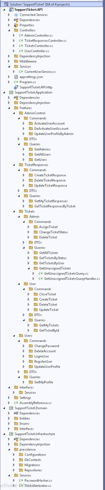

# 🎫 SupportTicket System

A clean, modular Support Ticket Management System built with **.NET 8**, applying modern architectural principles.

---

## 🧰 Tech Stack

- **.NET 8** (ASP.NET Core Web API)
- **CQRS + MediatR**
- **Clean Architecture**
- **Entity Framework Core**
- **PostgreSQL** (via Npgsql provider)
- **JWT Authentication**
- **Role-based Authorization**
- **Vertical Slice Architecture (by feature)**
- **Dependency Injection**

---

## 🧱 Folder Structure (Visual)

> Visual Studio view of the full solution structure



---

## 📁 Project Structure

```
SupportTicket
├── SupportTicket.API             # Entry point - Controllers, Middleware, Program.cs
├── SupportTicket.Application     # Features (Commands, Queries, DTOs)
├── SupportTicket.Domain          # Core Entities, Enums, Interfaces
├── SupportTicket.Infrastructure  # EFCore, PostgreSQL, Repositories
```

---

## 🚀 Features Overview

| Feature       | Description                                                   |
| ------------- | ------------------------------------------------------------- |
| 🧑‍💼 Admin      | Activate/Deactivate users, Assign tickets, Respond to tickets |
| 👤 User       | Register, Login, Update/Delete profile, Submit tickets        |
| 🎫 Tickets    | Create, Update, Close, Delete, View (by status/user)          |
| 💬 Responses  | Admin-only replies to tickets                                 |
| 🔐 Auth       | JWT-based login + Role-based access                           |
| 🧪 API Design | RESTful, separated by features                                |

---

## 🔌 PostgreSQL Integration

- Configured with **EF Core**
- Connection string defined in `appsettings.json`
- Migrations managed under `/Infrastructure/presistence/Migrations`

---

## 🚦 Run the App

```bash
# Clone the repo
git clone https://github.com/yourusername/support-ticket-system.git
cd SupportTicket

# Apply EF migrations (PostgreSQL)
dotnet ef database update

# Run API
dotnet run --project SupportTicket.API
```

---

## 📌 Notes

- Fully structured by **Feature-based folders**
- Uses `ICurrentUserService` for accessing JWT claims
- Designed to scale horizontally across domains (e.g. Notifications, Attachments, etc.)

---

## 🤝 Contributions

Feel free to fork the repo or open issues for discussion.

---

## 🧑‍💻 Author

Built with ❤️ by [Mohamed Abdelfattah]  
📬 Connect on [LinkedIn](https://www.linkedin.com/in/mabd-elfattah/)

---
